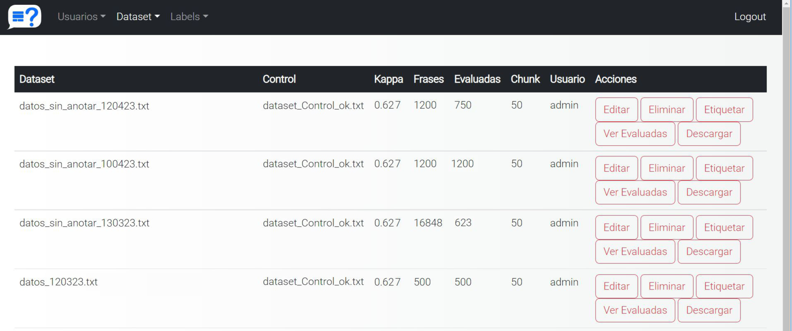
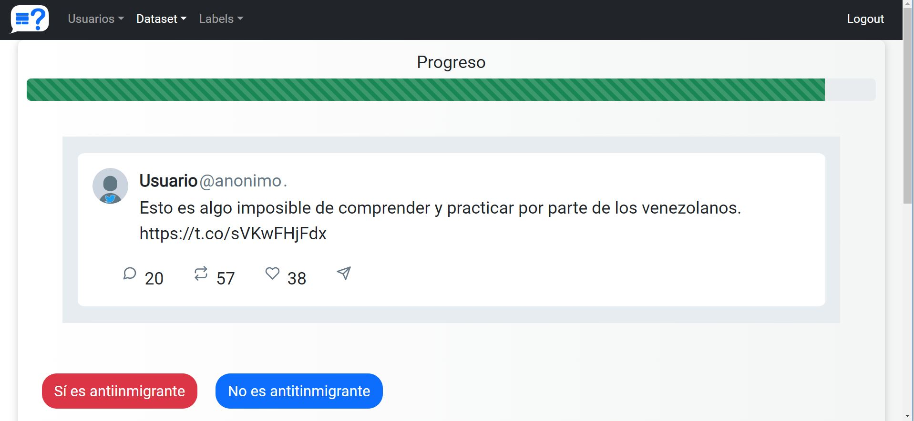

# Annotation platform
<a name="readme-top"></a>

<!-- TABLE OF CONTENTS -->
<details>
  <summary>Table of Contents</summary>
  <ol>
    <li>
      <a href="#about-the-project">About The Project</a>
    </li>
    <li>
    <a href="#implementation">Implementation</a>
    </li> 
    <li>
      <a href="#prerequisites">Prerequisites</a>
    </li>
    <li>
    <a href="#dependencies">Dependencies</a>
    </li> 
    <li>
    <a href="#authors">Authors</a>
    </li> 
  </ol>

</details>

<!-- ABOUT THE PROJECT -->
## About The Project

<p style="text-align: justify;">This project is about an annotation platform that enables users to annotate data by uploading a dataset. It offers the possibility to set the desired value of the inter-annotator kappa agreement coefficient, which determines the level of agreement required among annotators to annotate unlabeled data from the dataset. This customization ensures the production of high-quality annotated data. Additionally, the platform allows administrators to set the number of documents each user should annotate once they have passed the defined threshold.</p>

<p align="right">(<a href="#readme-top">back to top</a>)</p>

## Implementation
in process.. 

<div align="center">
  
  <p> Figure 1. Admin panel of the annotation platform. </p>
</div>


<div align="center">
  
  <p> Figure 2. User interface for annotating tweets in the platform.. </p>
</div>


<p align="right">(<a href="#readme-top">back to top</a>)</p>

## Prerequisites
Python 3.X installed
```
python --version

Python 3.10.0

```

<p align="right">(<a href="#readme-top">back to top</a>)</p>

## Dependencies
```
pandas==1.3.5
in process...
```

<p align="right">(<a href="#readme-top">back to top</a>)</p>

## Author
**Karina Yaneth Gazca Hernández**

**Alejandro Molina Villegas**

**Thomas Cattin**

**Edwyn Javier Aldana Bobadilla**


<p align="right">(<a href="#readme-top">back to top</a>)</p>
