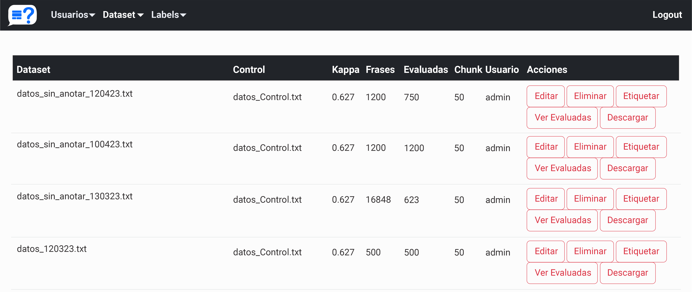

# Annotation platform
<a name="readme-top"></a>

<!-- TABLE OF CONTENTS -->
<details>
  <summary>Table of Contents</summary>
  <ol>
    <li>
      <a href="#about-the-project">About The Project</a>
    </li>
    <li>
    <a href="#implementation">Implementation</a>
    </li> 
    <li>
      <a href="#prerequisites">Prerequisites</a>
    </li>
    <li>
    <a href="#dependencies">Dependencies</a>
    </li> 
    <li>
    <a href="#authors">Authors</a>
    </li> 
  </ol>

</details>

<!-- ABOUT THE PROJECT -->
## About The Project

<p style="text-align: justify;">This project is about an annotation platform that enables users to annotate data by uploading a dataset. It offers the possibility to set the desired value of the inter-annotator kappa agreement coefficient, which determines the level of agreement required among annotators to annotate unlabeled data from the dataset. This customization ensures the production of high-quality annotated data. Additionally, the platform allows administrators to set the number of documents each user should annotate once they have passed the defined threshold.</p>

<p style="text-align: justify;">
The methodology is described in the article:

Molina-Villegas, A., Cattin T., Gazca-Hernandez K. & Aldana-Bobadilla E. (2023). High-quality Data from Crowdsourcing Towards the Creation of The Mexican Anti-immigrant Speech Corpus. *Applied Sciences. Section: Computing and Artificial Intelligence. ISSN 2076-3417 (in press)*
</p>
  
<p style="text-align: justify;">
If you want a copy of the related data please send us an email:
</p>

```
karina.gazca@cinvestav.mx, edwyn.aldana@cinvestav.mx,  amolina@centrogeo.edu.mx
```

<p align="right">(<a href="#readme-top">back to top</a>)</p>

## Implementation


<div align="center">
  
  <p> Figure 1. Admin panel of the annotation platform. </p>
</div>


<div align="center">
  
  <p> Figure 2. User interface for annotating tweets in the platform. </p>
</div>


<p align="right">(<a href="#readme-top">back to top</a>)</p>

## Prerequisites
Python 3.X installed
```
python --version

Python 3.10.0


```

<p align="right">(<a href="#readme-top">back to top</a>)</p>

## Dependencies
```
pandas==1.3.5
cryptography==38.0.1
Flask==2.0.2
Flask_Session==0.4.0
Flask_SQLAlchemy==2.5.1
numpy==1.23.0
scikit_learn==1.2.2
SQLAlchemy==1.4.36
Werkzeug==2.0.2
```

<p align="right">(<a href="#readme-top">back to top</a>)</p>

## Authors
**Karina Yaneth Gazca Hernández**

**Alejandro Molina Villegas**

**Thomas Cattin**

**Edwyn Javier Aldana Bobadilla**


<p align="right">(<a href="#readme-top">back to top</a>)</p>
